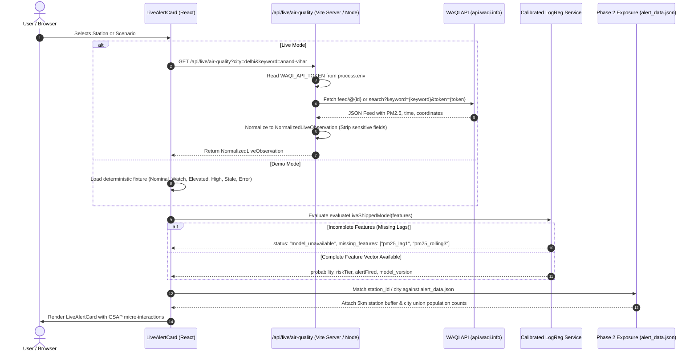

# VayuDrishti Live-Alert Integration Slice

## 1. Executive Summary & Objective

This document details the architecture, data contracts, inference logic, security posture, and limitations of the thin end-to-end live-alert demonstration slice:

$$\text{WAQI} \longrightarrow \text{Normalize Live Observation} \longrightarrow \text{Shipped Calibrated Model} \longrightarrow \text{Risk Probability} \longrightarrow \text{Risk Tier} \longrightarrow \text{People Exposed} \longrightarrow \text{Alert UI}$$

This implementation satisfies all Phase 2f risk-tier specifications without modifying any Phase 1 model weights, metrics, thresholds, or Phase 2 exposure baselines.

---

## 2. Live WAQI Ingestion & Data Flow



---

## 3. Normalized Live Observation Schema

All live observations entering the client conform strictly to `NormalizedLiveObservation` defined in [`src/types/liveAlert.ts`](file:///src/types/liveAlert.ts):

| Field | Type | Description |
| :--- | :--- | :--- |
| `station_id` | `string` | Unique identifier (e.g. `WAQI-1453` or Kaggle ID `DL002`) |
| `station_name` | `string` | Human-readable station name |
| `city` | `string` | Normalized city name |
| `latitude` | `number` | Sensor latitude |
| `longitude` | `number` | Sensor longitude |
| `coord_quality` | `"exact" \| "manual" \| "suspect" \| "city_point"` | Ground-truth coordinate lineage |
| `observed_at` | `string (ISO 8601)` | Timestamp reported by station |
| `received_at` | `string (ISO 8601)` | Timestamp when system received packet |
| `age_minutes` | `number` | Current latency elapsed in minutes |
| `is_stale` | `boolean` | Flagged `true` if latency exceeds stale threshold (6 hours) |
| `pm25_current` | `number` | Instantaneous PM2.5 reading ($\mu g/m^3$) |
| `source` | `"WAQI" \| "DEMO" \| "FALLBACK"` | Provenance marker |
| `is_demo` | `boolean` | Strict indicator preventing demo confusion with real data |
| `attribution` | `string` | Data source attribution statement |

---

## 4. Shipped Model Inference Flow

The production/shipped model is **Calibrated Logistic Regression** (`models/phase1_final_logreg.pkl`). LightGBM remains a statistical challenger only and is not used in production inference.

### Required Features

The shipped model depends on 4 features extracted during Phase 1 (strict order matching `models/phase1_final_logreg.pkl`):
1. `PM2.5`: Current day's PM2.5 ($\mu g/m^3$)
2. `pm25_lag1`: 24-hour previous day lag ($\mu g/m^3$)
3. `pm25_rolling3`: 3-day backward rolling mean on days [$t-2, t-1, t$] ($\mu g/m^3$)
4. `pm25_ratio_90`: Ratio of current PM2.5 to the fixed CPCB acute spike threshold ($90.0\,\mu g/m^3$), i.e., $PM2.5 / 90.0$. (NOT a station-specific or city-specific 90th percentile; NOT 150.0).

### Mathematical Pipeline

1. **StandardScaler Transformation**:
   $$z_i = \frac{x_i - \mu_i}{\sigma_i}$$
   Parameters in [`src/data/shipped_model_parameters.json`](file:///src/data/shipped_model_parameters.json) (matching `models/phase1_final_logreg.pkl`):
   - $\mu = [48.8066, 54.6801, 53.8681, 0.5423]$
   - $\sigma = [21.3909, 38.1000, 29.3956, 0.2377]$
   - Note: $\mu[0] / \mu[3] = 48.8066 / 0.5423 = 90.0$ and $\sigma[0] / \sigma[3] = 21.3909 / 0.2377 = 90.0$, confirming the exact fixed $90.0$ denominator.

2. **Logistic Regression Raw Margin**:
   $$\text{logit} = w_0 + \sum_{i=1}^4 w_i \cdot z_i$$
   - Coefficients: $w = [0.70122, -0.07485, 0.44325, 0.70122]$
   - Intercept: $w_0 = -3.19349$
   - Uncalibrated probability: $p_{\text{raw}} = \sigma(\text{logit}) = \frac{1}{1 + e^{-\text{logit}}}$

3. **Isotonic Calibration**:
   $$p_{\text{calibrated}} = \text{PiecewiseLinearInterp}(p_{\text{raw}}, \mathbf{X}_{\text{isotonic}}, \mathbf{Y}_{\text{isotonic}})$$
   - Preserves all 98 knots exported directly from `CalibratedClassifierCV(method='isotonic')`.
   - Verified against scikit-learn with maximum absolute error $< 10^{-17}$.

---

## 5. Risk-Tier Policy & Alert Threshold

The integration adheres to the exact **Phase 2f Risk-Tier Policy**:

| Risk Tier | Calibrated Probability ($p$) | Operational Definition | Alert Boolean |
| :--- | :--- | :--- | :--- |
| **Nominal** | $p < 0.05$ | Routine conditions / background variation | **Inactive** (`false`) |
| **Watch** | $0.05 \le p < 0.22$ | Advisory tier / early warning spike trend | **Active** (`true`) |
| **Elevated** | $0.22 \le p < 0.50$ | Actionable tier / high confidence spike | **Active** (`true`) |
| **High** | $p \ge 0.50$ | Emergency tier / extreme spike trajectory | **Active** (`true`) |

**Alert Operating Threshold**: $p \ge 0.050$. Any probability $\ge 0.05$ triggers an alert and will **never** display "Nominal".

---

## 6. Exposure Lookup Integration

The live alert connects directly to the static Phase 2 population exposure artifacts in `src/data/alert_data.json`:
- **Station 5km Buffer**: Population count residing within the 5 km radial buffer of the monitoring station.
- **City 5km Union Population**: Total population residing within the union of all 5 km station buffers in that city.
- **Already Poor Baseline**: Share of days historically in the Already Poor baseline ($PM2.5 \ge 90\,\mu g/m^3$).

> [!IMPORTANT]
> The live alert UI does **not** recalculate population rasters dynamically. It explicitly displays:
> *"Static Phase 2 exposure raster estimate (WorldPop 2020 via Phase 2 pipeline). Live WAQI observations do not generate real-time population rasters."*

---

## 7. Safety, Latency & Stale-Data Rules

The application supports four mutually exclusive system states:

1. **Fresh (`fresh`)**:
   Observation age is within 360 minutes (6 hours) and complete model features are present.
2. **Stale (`stale`)**:
   Observation age exceeds 360 minutes ($>6$ hours). Clearly marked with orange warning banners and timestamps to prevent acting on outdated readings.
3. **Model Unavailable (`model_unavailable`)**:
   Observation is fresh, but required lag features (`pm25_lag1`, `pm25_rolling3`) cannot be safely computed. Raw PM2.5 is displayed, but inference probability and alert triggers are **withheld**.
4. **API Error (`error`)**:
   WAQI request timed out ($>8000$ ms), rate-limited, or failed upstream. Error message shown cleanly with fallback to deterministic demo fixtures.

---

## 8. Deterministic Local Demo Mode

For offline development, evaluation, and CI testing when WAQI API credentials or network connections are unavailable, a deterministic demo suite is embedded in [`src/services/liveDemoFixtures.ts`](file:///src/services/liveDemoFixtures.ts):

- **Scenario: Nominal** ($p = 0.027 < 0.05$): Anand Vihar baseline, no alert.
- **Scenario: Watch** ($p = 0.141 \in [0.05, 0.22)$): Bandra, Mumbai advisory.
- **Scenario: Elevated** ($p = 0.384 \in [0.22, 0.50)$): Adarsh Nagar, Jaipur actionable alert.
- **Scenario: High** ($p = 0.722 \ge 0.50$): Punjabi Bagh, Delhi emergency alert.
- **Scenario: Stale Data**: Observation 540 minutes old (9 hours ago).
- **Scenario: Model Unavailable**: Live observation missing historical lag features.
- **Scenario: API Error**: Simulated upstream network timeout.

Every demo fixture is prominently badged with `DEMO DATA — NOT LIVE`.

---

## 9. Security & Secret Safeguards

1. **Token Seclusion**: `WAQI_API_TOKEN` is read exclusively server-side via `process.env.WAQI_API_TOKEN` in [`src/server/liveApiHandler.ts`](file:///src/server/liveApiHandler.ts).
2. **Git Hygiene**:
   - `.env` and `.env.*` are explicitly ignored in [`.gitignore`](file:///.gitignore).
   - `.env.example` is committed with placeholder keys only.
3. **Bundle Audit**:
   - Client bundle build (`dist/assets/*.js`) contains **zero** instances of `WAQI_API_TOKEN` or raw token strings.
4. **Error Masking**: Upstream error handlers strip tokens from exception messages before sending responses to the browser.
5. **No HTML Injection**: All textual data renders through React JSX text interpolation.

---

## 10. Missing Model Features Analysis & Honest Limitations

### Critical Feature Gap

| Shipped Model Feature | In Live WAQI Feed? | Safe Derivation from Single Live Request? | Resolution |
| :--- | :---: | :---: | :--- |
| `PM2.5` | **YES** | Yes (instantaneous reading) | Ingested directly |
| `pm25_ratio_90` | **YES** | Yes ($PM2.5 / 90.0$, CPCB acute threshold) | Computed directly |
| `pm25_lag1` | **NO** | **NO** (requires reading 24h prior) | **Unavailable from single observation** |
| `pm25_rolling3` | **NO** | **NO** (requires 72h window) | **Unavailable from single observation** |

### Policy on Missing Features

Per project requirements:
- We **refuse to fabricate or substitute random numbers** for missing lags.
- If only a single instantaneous WAQI observation is provided without historical telemetry, the model status is honestly marked `model_unavailable` with `missing_features: ["pm25_lag1", "pm25_rolling3"]`.
- To demonstrate end-to-end inference in this slice, the demo mode and simulated feature vectors provide valid lag histories to test the full mathematical pipeline.
- The isolated abstraction in [`src/services/historicalObservationStore.ts`](file:///src/services/historicalObservationStore.ts) defines how a 72-hour historical station telemetry buffer connects in a production architecture.

---

## 11. Server Boundary & Production Architecture

| Environment | Endpoint Execution Method | Status |
| :--- | :--- | :--- |
| **Vite Development (`npm run dev`)** | `configureServer` middleware in `vite.config.ts` | **Operational** (Server-side Node.js) |
| **Vite Preview (`npm run preview`)** | `configurePreviewServer` middleware in `vite.config.ts` | **Operational** (Local Preview Node.js) |
| **Production Build (`npm run build`)** | Static client assets in `dist/` | **Requires Backend Runtime** (Node.js/Python server or Serverless Function) |

*The Vite middleware is an integration adapter for development and preview verification. True production deployment of `dist/` requires a serverless function (AWS Lambda, Vercel API, Cloudflare Worker) or a dedicated container running `handleLiveAirQualityRequest` to hold the secret `WAQI_API_TOKEN` without exposing it to the browser bundle.*

---

## 13. Continuous Historical Feature Pipeline (Phase 5 f1 + f2)

### 13.1 Architecture Overview

The Phase 5 continuous pipeline bridges the gap between instantaneous external telemetry feeds and the 4-feature autoregressive vector required by the Phase 1 shipped model:

```
[ WAQI API ]
     │ (poll / event)
     ▼
[ Ingestion Scheduler ] ──(Rate Limit & Concurrency Mutex)
     │
     ▼
[ Persistent Station Store ] ──(Deduplicate & Prune >7d)
     │
     ▼
[ Canonical Feature Engine ] ──(computeLivePhase1Features)
     │
     ├── Incomplete History (<72h or Date Gap) ──► MODEL UNAVAILABLE (Suppresses probability)
     │
     └── Complete History (t, t-1, t-2)
          │
          ▼
     [ Shipped Calibrated LogReg ]
          │
          ▼
     [ Phase 2f Risk Tier & Exposure ]
          │
          ▼
     [ Live Alert Card UI ]
```

### 13.2 Historical Buffer & 72-Hour Requirement Justification

The Phase 1 model requires:
1. `PM2.5`: Instantaneous observation at day $t$.
2. `pm25_lag1`: Daily representative PM2.5 for day $t-1$ (yesterday).
3. `pm25_rolling3`: 3-day backward rolling mean: $\frac{\text{day } t-2 + \text{day } t-1 + \text{day } t}{3}$.
4. `pm25_ratio_90`: $\frac{\text{PM2.5}}{90.0}$ (ratio to the fixed $90.0\,\mu\text{g/m}^3$ CPCB acute threshold).

**Justification for 72 Hours**:
- Because `pm25_rolling3` computes a backward rolling average over a 3-day window $[t-2, t-1, t]$, observations from $t-2$ (48 to 72 hours prior) are strictly required.
- If only 24 or 48 hours of history are available, the $t-2$ day average cannot be calculated honestly.
- Therefore, a minimum of **72 continuous hours** of station observations is strictly necessary to compute the 4-feature vector without synthesizing fake numbers.

### 13.3 Idempotency, Deduplication & Stale Handling

1. **Idempotent Storage**: The store uniquely keys entries by `station_id + observed_at`. Repeated ingestions of the identical observation timestamp are ignored without creating duplicates.
2. **Out-of-Order Safety**: Observations arriving out of chronological order are inserted and sorted ascendingly by timestamp.
3. **Future Timestamp Protection**: Observations with timestamps $> 5$ minutes in the future are rejected to prevent clock skew or temporal contamination.
4. **Stale Threshold**: Readings $> 360$ minutes old (6 hours) are flagged `is_stale: true`, suppressing active alerts.
5. **Retention Pruning**: Observations older than 168 hours (7 days) are automatically pruned to prevent unbounded memory/disk growth.

### 13.4 Exact Conditions for `MODEL UNAVAILABLE`

The system strictly halts inference and returns `status: "model_unavailable"` when:
1. **Zero Prior History**: A station has just been registered and has no previous records.
2. **Missing `pm25_lag1`**: No observations exist for calendar day $t-1$.
3. **Missing `pm25_rolling3`**: No observations exist for calendar day $t-2$.
4. **Temporal Gaps**: Incomplete calendar day coverage between $t-2$ and $t$.
5. **Invalid Current Observation**: Current PM2.5 is null, NaN, or negative.

### 13.5 Scheduler & Production Runtime Requirements

- **Local / Preview Runtime**: Integrated directly into Node.js via Vite's `configureServer` and `configurePreviewServer` middlewares.
- **Production Deployment Boundary**: The client build (`dist/`) is static HTML/JS/CSS. A true production scheduler requires hosting [`src/server/ingestionScheduler.ts`](file:///src/server/ingestionScheduler.ts) on a persistent Node.js worker (e.g. AWS ECS / Docker / Render / Railway) or a periodic serverless cron function (AWS Lambda + EventBridge / Cloudflare Worker Cron) to poll stations and persist telemetry into a database (TimescaleDB / PostgreSQL / Redis).

### A. Run with Deterministic Demo Fixtures (No Token Required)

```bash
npm run dev
```
Navigate to `http://localhost:5173/` and click the **Live Alerts** tab in the top navigation. Use the Scenario selector to test Nominal, Watch, Elevated, High, Stale, Model Unavailable, and Error states.

### B. Run with Real WAQI Token

1. Create a `.env` file in the project root:
   ```bash
   cp .env.example .env
   ```
2. Edit `.env` and insert your WAQI API key:
   ```env
   WAQI_API_TOKEN=your_actual_waqi_api_token_here
   ```
3. Restart the dev server:
   ```bash
   npm run dev
   ```
4. On the Live Alert Card, select **"Live Feed (WAQI API)"** in the Scenario dropdown.

### C. Run Verification Test Suite

```bash
npm run test:live
```
Executes all 55 test assertions covering tier boundaries, alert booleans, calibration mathematics, stale detection, error handling, demo tagging, and coordinate lineage.
